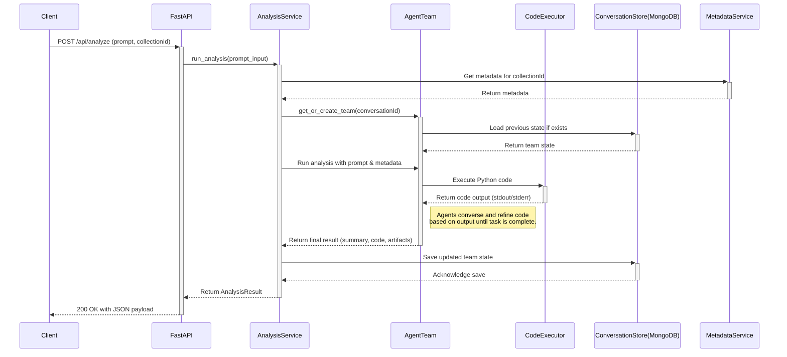

# **bi-agents**

`bi-agents` is an intelligent backend service that uses a multi-agent system (powered by Microsoft AutoGen) to perform complex, stateful data analysis. It provides a robust API for interacting with autonomous AI agents that can reason about data, write and execute code, and generate human-readable insights.

[](https://github.com/transorg-engineering/bi-agents)
[](https://github.com/transorg-engineering/bi-agents)
[](https://github.com/transorg-engineering/bi-agents)

---

## **Table of Contents**

- [Architectural Principles](#architectural-principles)
- [System Flow](#system-flow)
- [Developer Quickstart](#developer-quickstart)
- [Project Structure](#project-structure)
- [Testing Philosophy](#testing-philosophy)
- [Your First Contribution: Onboarding Missions](#your-first-contribution-onboarding-missions)
- [Architectural Decisions & Future Work](#architectural-decisions--future-work)
- [API Endpoints](#api-endpoints)

---

## **Architectural Principles**

This project is built on a set of core principles that enable robust and scalable agentic workflows.

*   **Agent-First Design**: The core business logic resides within autonomous agents defined in `src/bi_agents/agents/`. Services act as orchestrators, but the "thinking" is delegated to the agent team.
*   **Contract-Based Communication**: Agents and services communicate using strict Pydantic schemas (`src/bi_agents/schemas.py`), not fragile string parsing. This ensures reliability and type safety, eliminating a major source of runtime errors. (See ADR: [Agent Contracts](./Next-steps/agent-contracts.md))
*   **Stateful, Resumable Conversations**: Agent conversations are long-running and can be paused and resumed. We persist the entire team state in MongoDB (`src/bi_agents/database/mongo_handler.py`), allowing for complex, multi-turn analysis.
*   **Isolated & Secure Runtimes**: All agent-generated code is executed in a sandboxed environment (`src/bi_agents/runtime/`) for security and dependency management. Each analysis request gets its own temporary workspace, which is destroyed after completion.

## **System Flow**

A typical analysis request follows this path through the system:



## **Developer Quickstart**

### **Prerequisites**

*   Python 3.10+
*   Docker & Docker Compose
*   An IDE (VSCode with the Python extension is recommended)

### **1. Clone the Repository**

```bash
git clone https://github.com/transorg-engineering/bi-agents
cd bi-agents
```

### **2. Configure Environment Variables**

Create a `.env` file in the project root by copying the example. This file stores secrets and configuration, and is ignored by Git.

```bash
cp .env
```

Now, edit `.env` and fill in the required values:

```env
# .env
OPENAI_API_KEY="sk-..."
AZURE_STORAGE_CONNECTION_STRING="DefaultEndpointsProtocol=..."
AZURE_CONTAINER_NAME="data"
MONGODB_URI="mongodb+srv://..."
```

### **3. Installation & Setup**

We use `pip-tools` to manage dependencies. `requirements.in` lists the high-level packages, and `requirements.txt` is the locked, reproducible environment.

The provided PowerShell script automates the setup:

```powershell
# This script creates a venv, installs tools, compiles requirements, and installs them.
./quickstart.ps1
```

Or, to do it manually:

```bash
# Create and activate a virtual environment
python -m venv .venv
# On Windows:
.venv\Scripts\activate
# On macOS/Linux:
source .venv/bin/activate

# Install dependencies
pip install -r requirements.txt
```

### **4. Running the Application**

#### **Local Development (with Hot-Reload)**

This is the best option for active development. The server will automatically restart when you save a file.

```bash
uvicorn bi_agents.main:app --app-dir src --reload
```

Navigate to [http://127.0.0.1:8000/docs](http://127.0.0.1:8000/docs) to see the interactive API documentation.

#### **Via Docker Compose**

This runs the application exactly as it would be in a production-like environment. It also handles persistent logging.

```bash
docker-compose up --build
```

The service will be available at [http://127.0.0.1:8000](http://127.0.0.1:8000).

## **Project Structure**

The codebase is organized to separate concerns, making it easier to navigate and maintain.

```
└── bi-agents/
    ├── .env                  # Local environment variables (ignored by git)
    ├── docker-compose.yml    # Defines the containerized service
    ├── dockerfile            # Multi-stage build for a lean, secure production image
    ├── requirements.in       # High-level dependencies
    ├── requirements.txt      # Pinned dependencies for reproducible builds
    ├── Next-steps/           # Architectural Decision Records (ADRs) and planning docs
    ├── src/
    │   └── bi_agents/
    │       ├── __init__.py
    │       ├── main.py         # FastAPI app entrypoint, middleware, and logging setup
    │       ├── config.py       # Centralized Pydantic-based settings management
    │       ├── schemas.py      # Core Pydantic data models for agent outputs and validation
    │       ├── agents/         # The "brain": Defines agent roles, prompts, and team dynamics
    │       ├── api/            # The "skin": FastAPI routers and API-specific data models
    │       ├── database/       # The "memory": Handles all interaction with MongoDB
    │       ├── devtools/       # The "eyes": Custom logging configurations
    │       ├── runtime/        # The "hands": Secure, sandboxed code execution environments
    │       ├── services/       # The "nerves": Orchestrates business logic, connecting API to agents
    │       └── storage/        # The "pantry": Interacts with external file storage (Azure Blob)
    └── tests/
        ├── conftest.py         # Core pytest fixtures, including mocking of external services
        └── ...                 # Unit and integration tests for each service
```

## **Testing Philosophy**

We use `pytest` for automated testing. Our strategy is to **mock all external services** (LLMs, databases, Azure Blob Storage) to test our internal logic in isolation. This makes tests fast, reliable, and free of external dependencies.

*   **To run all tests:**
    ```bash
    pytest
    ```
*   **Core Mocking Logic:** Check `tests/conftest.py` to see how we use `unittest.mock` to patch external clients across the entire test suite.

* Note: Some existing tests may not yet reflect the latest refactoring to contract-based outputs and are slated for updates.

## **Your First Contribution: Onboarding Missions**

Welcome, Agent! The best way to get familiar with the codebase is to complete a hands-on mission. Each mission is designed to guide you through a critical part of the system.


**[➡️ Read the Full Mission Briefs Here](./Next-steps/onboarding_missions.md)**

## **API Endpoints**

The application exposes the following primary endpoints. For full details, run the app and see the interactive documentation at `/docs`.

*   **`POST /api/upload`**: Upload a CSV or SQLite file for processing and storage in Azure Blob Storage.
*   **`POST /api/fetch_metadata`**: Generates (or retrieves from cache) a rich, descriptive summary of a dataset, including schemas, summaries, and titles.
*   **`POST /api/analyze`**: The main analysis endpoint. Send a natural language prompt to an agent team to perform analysis on a specified dataset.
